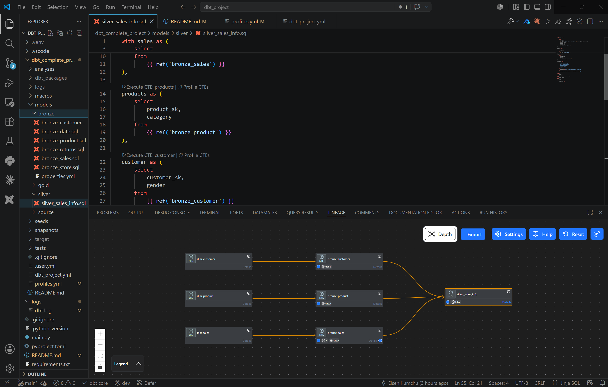

# 🧱 dbt + Databricks — Medallion Lakehouse Pipeline

> An end-to-end analytics-engineering project built with **dbt Core** on the **Databricks Lakehouse** (Unity Catalog), implementing a **bronze → silver → gold** medallion architecture with testing, snapshots (SCD Type 2), Jinja macros, and a dev → prod deployment workflow.

<p align="left">
  
  
  
  
  
  
</p>

---

## 📑 Table of Contents

- [Overview](#-overview)
- [Architecture](#-architecture)
- [Data Lineage](#-data-lineage)
- [Tech Stack](#-tech-stack)
- [Repository Structure](#-repository-structure)
- [Prerequisites](#-prerequisites)
- [Getting Started](#-getting-started)
- [Configuration](#-configuration)
- [Usage](#-usage)
- [Data Quality & Testing](#-data-quality--testing)
- [Snapshots (SCD Type 2)](#-snapshots-scd-type-2)
- [Deployment (dev → prod)](#-deployment-dev--prod)
- [Command Reference](#-command-reference)
- [Roadmap](#-roadmap)
- [License](#-license)

---

## 🔎 Overview

This repository transforms raw retail source data into analytics-ready models entirely **inside the warehouse**, using dbt as the transformation (the **T** in **ELT**) layer. dbt compiles modular SQL + Jinja into native Databricks SQL and pushes execution down to a Databricks **SQL Warehouse** — dbt itself holds no compute.

**What this project demonstrates:**

- A clean **medallion** model layout (bronze / silver / gold) with per-layer schemas
- **Sources** with declared lineage via the `source()` function
- Reusable logic with **Jinja macros** and dynamic SQL
- **Data quality** enforced with generic, singular, and custom generic tests
- **Slowly Changing Dimension Type 2** history tracking via dbt **snapshots**
- **Seeds** for static lookup/mapping data
- A **dev → prod** promotion workflow driven by `target` variables and environment-based secrets

---

## 🏗 Architecture

```
                ┌──────────────────────────────────────────────────────┐
  Source CSVs   │                  Databricks Lakehouse                 │
  (Delta)  ───► │  source schema                                        │
                │      │                                                │
                │      ▼            dbt (transform layer)               │
                │  ┌────────┐   ┌────────┐   ┌────────┐                 │
                │  │ BRONZE │──►│ SILVER │──►│  GOLD  │                  │
                │  │ raw 1:1│   │ OBT /  │   │ SCD2 / │                  │
                │  │ + tests│   │ KPIs   │   │ dims   │                  │
                │  └────────┘   └────────┘   └────────┘                 │
                └──────────────────────────────────────────────────────┘
                         ▲ compute borrowed from Databricks SQL Warehouse
```

| Layer | Materialization | Purpose |
|-------|-----------------|---------|
| **Bronze** | table | Raw source loaded 1:1, no transformations, with key/quality tests |
| **Silver** | table | Cleaned, joined, enriched models — including a denormalized *One Big Table* / KPI aggregation |
| **Gold** | table / snapshot | Business-facing dimensions and **SCD2** history |

---

## 🔗 Data Lineage

The full model lineage, visualized in the **Power User for dbt** extension. Raw
sources flow into the bronze layer, which is then joined and aggregated into the
`silver_sales_info` model:



**Flow:**

- **Sources** (`dim_customer`, `dim_product`, `fact_sales`) — raw Delta tables in the `source` schema
- **Bronze** — `bronze_customer` (table), `bronze_product` (view), `bronze_sales` (view): raw 1:1 loads with tests
- **Silver** — `silver_sales_info` (table): the three bronze models joined into a single analytics-ready model

Every model uses `ref()` / `source()`, so dbt builds and validates this dependency
graph automatically — there are no hard-coded table references.

## 🧰 Tech Stack

| Tool | Role |
|------|------|
| **dbt Core** | Transformation framework (models, tests, snapshots, macros) |
| **dbt-databricks** | Adapter connecting dbt to the Databricks SQL Warehouse |
| **Databricks (Unity Catalog)** | Lakehouse platform — storage + compute |
| **Python 3.12** | Runtime for dbt |
| **uv** | Fast Python project & dependency manager |
| **Git** | Version control & feature-branch workflow |
| **VS Code + Power User for dbt** | Local development, autocomplete, lineage |

---

## 📁 Repository Structure

The repository root is a **uv-managed Python project** that wraps the dbt project in `dbt_complete_project/`.

```
DBT_PROJECT/                         # repo root (uv project)
├── dbt_complete_project/            # the dbt project
│   ├── analyses/                    # ad-hoc, compiled-only queries (not built)
│   │   ├── 1_explore.sql
│   │   ├── jinja-1.sql              # Jinja: variables
│   │   ├── jinja-2.sql              # Jinja: for-loops
│   │   ├── jinja-3.sql              # Jinja: dynamic SQL / incremental flag
│   │   └── query_macro.sql          # calling a macro
│   ├── macros/
│   │   ├── generate_schema.sql      # overrides generate_schema_name → clean schemas
│   │   └── multiply.sql             # example reusable transformation macro
│   ├── models/
│   │   ├── source/
│   │   │   └── sources.yml          # raw table declarations (source() lineage)
│   │   ├── bronze/
│   │   │   ├── bronze_customer.sql
│   │   │   ├── bronze_date.sql
│   │   │   ├── bronze_product.sql
│   │   │   ├── bronze_returns.sql
│   │   │   ├── bronze_sales.sql
│   │   │   ├── bronze_store.sql
│   │   │   └── properties.yml       # column tests + materialization overrides
│   │   ├── silver/
│   │   │   └── silver_sales_info.sql   # One Big Table / KPI aggregation
│   │   └── gold/
│   │       └── source_gold_items.sql   # deduplicated feed for the snapshot
│   ├── snapshots/
│   │   └── gold_items.yml           # SCD Type 2 (timestamp strategy)
│   ├── seeds/
│   │   └── lookup.csv               # static mapping/lookup table
│   ├── tests/
│   │   ├── generic/                 # custom generic tests
│   │   └── non_negative_test.sql    # singular test
│   ├── dbt_project.yml              # project config: paths, materializations, schemas
│   ├── profiles.yml                 # connection/targets (dev & prod) — token via env var
│   └── README.md
│
├── main.py
├── pyproject.toml                   # uv project + dependencies
├── uv.lock                          # pinned dependency lockfile
├── requirements.txt                 # exported dependency list
├── .python-version                  # pins Python 3.12
├── .gitignore
└── README.md
```

> `target/`, `dbt_packages/`, `logs/`, and `.venv/` are build/runtime artifacts and are git-ignored.

---

## ✅ Prerequisites

- A free **[Databricks Free Edition](https://www.databricks.com/learn/free-edition)** account (Unity Catalog + SQL Warehouse)
- **Python 3.12**
- **[uv](https://docs.astral.sh/uv/)**
- **Git**
- **VS Code** (recommended, with the *Power User for dbt* extension)

> **Note on Python:** dbt Core 1.9+ supports Python 3.13, but adapter support can lag. **3.12** is the safest currently-supported version for `dbt-databricks`.

---

## 🚀 Getting Started

### 1. Clone the repository

```bash
git clone https://github.com/<your-username>/<your-repo>.git
cd <your-repo>
```

### 2. Set up the environment with uv (run at the repo root)

```bash
uv sync                 # creates the .venv from pyproject.toml / uv.lock
```

### 3. Configure your Databricks token

Create a Personal Access Token in Databricks (**Settings → Developer → Access tokens**) and export it as an environment variable:

```bash
# macOS / Linux
export DBT_DATABRICKS_TOKEN="dapi-xxxxxxxxxxxxxxxx"

# Windows PowerShell
$env:DBT_DATABRICKS_TOKEN="dapi-xxxxxxxxxxxxxxxx"
```

### 4. Verify the connection (from inside the dbt project)

```bash
cd dbt_complete_project
uv run dbt debug          # should report: All checks passed!
```

---

## ⚙ Configuration

`dbt_complete_project/profiles.yml` holds the warehouse connection. It is **git-ignored**, so credentials never reach the repo. The expected shape:

​```yaml
dbt_complete_project:
  target: dev
  outputs:
    dev:
      type: databricks
      catalog: dbt_project_dev
      schema: default
      host: <your-host>
      http_path: <your-http-path>
      token: "{{ env_var('DBT_DATABRICKS_TOKEN') }}"
      threads: 1
    prod:
      type: databricks
      catalog: dbt_project_prod
      schema: default
      host: <your-host>
      http_path: <your-http-path>
      token: "{{ env_var('DBT_DATABRICKS_TOKEN') }}"
      threads: 1
​```

**To run locally:** fill in your own `host` / `http_path`, then provide the token via the `DBT_DATABRICKS_TOKEN` environment variable (or paste it directly into your local, git-ignored `profiles.yml`).

Per-layer schemas are set in `dbt_project.yml`, and a custom `generate_schema_name` macro (`macros/generate_schema.sql`) produces clean schema names (`bronze`, `silver`, `gold`) without the default `<target>_` prefix.

---

## ▶ Usage

```bash
cd dbt_complete_project

# Build everything: models + seeds + snapshots + tests (DAG order)
uv run dbt build

# Or run pieces individually
uv run dbt run                          # models only
uv run dbt run --select models/silver   # a single folder
uv run dbt seed                         # load seeds
uv run dbt snapshot                     # build SCD2 snapshots
uv run dbt test                         # run all tests
```

---

## 🔬 Data Quality & Testing

Three layers of testing are implemented:

| Type | Example | Location |
|------|---------|----------|
| **Generic** | `unique`, `not_null`, `accepted_values` | `models/**/properties.yml` |
| **Singular** | "no negative amounts" assertion | `tests/non_negative_test.sql` |
| **Custom generic** | reusable non-negative test | `tests/generic/` |

Test severity is tunable (`error` vs `warn`) so non-critical checks don't block a build.

```bash
uv run dbt test
# → PASS=… WARN=… ERROR=…
```

---

## 🕰 Snapshots (SCD Type 2)

The gold layer tracks history using a **timestamp-strategy snapshot**. A deduplicating model (`models/gold/source_gold_items.sql`) feeds the snapshot so the `unique_key` is unique per run, and dbt manages `dbt_valid_from` / `dbt_valid_to` automatically.

```yaml
snapshots:
  - name: gold_items
    relation: "ref('source_gold_items')"
    config:
      schema: gold
      database: "{{ target.catalog }}"
      unique_key: id
      strategy: timestamp
      updated_at: update_date
      dbt_valid_to_current: "to_timestamp('9999-12-31')"
```

When a source record changes, the previous version is closed off and a new current row is inserted — full SCD2 history with no manual MERGE logic.

---

## 🚢 Deployment (dev → prod)

Promotion requires **zero code changes** — every catalog reference is parameterized with `{{ target.catalog }}`. Switch environments with the `--target` flag:

```bash
# Feature-branch workflow
git switch -c feature/my-change
# ... develop & commit ...
git switch main
git merge feature/my-change

# Deploy the full project to production
uv run dbt build --target prod
```

> In a full CI/CD setup, `dbt build --target prod` is triggered automatically by GitHub Actions on merge to `main`, with the token supplied from a repository secret and `--select state:modified+` to build only what changed.

---

## 📖 Command Reference

| Command | Description |
|---------|-------------|
| `dbt debug` | Test the connection & config |
| `dbt run` | Build models |
| `dbt test` | Run all tests |
| `dbt seed` | Load CSV seeds |
| `dbt snapshot` | Build SCD2 snapshots |
| `dbt build` | models + seeds + snapshots + tests in DAG order |
| `dbt build --target prod` | Deploy to production |
| `dbt compile` | Compile Jinja → SQL into `target/` |
| `dbt docs generate && dbt docs serve` | Build & serve the docs/lineage site |
| `dbt clean` | Remove build artifacts |

*(Prefix with `uv run` to use the project environment.)*

---

## 🗺 Roadmap

- [ ] Add **incremental models** (`is_incremental()`) for large fact tables
- [ ] Integrate **dbt_utils** package macros and tests
- [ ] Add **source freshness** checks
- [ ] Generate and publish **dbt docs** (DAG + column-level lineage)
- [ ] Add **unit tests** for transformation logic
- [ ] Wire up **GitHub Actions** CI/CD pipeline

---

## 📝 License

This project is released under the **MIT License**. See [`LICENSE`](LICENSE) for details.

---

<p align="center"><sub>Built as a hands-on analytics-engineering project to demonstrate production-style dbt + Databricks workflows.</sub></p>
